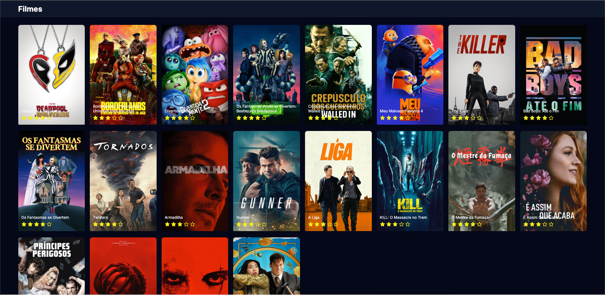

# Listagem de Filmes

## Aplicação simples para fins de conhecimento próprio

Esse é um projeto em React, Next, e TypeScript, nele foi utilizado axios para a realização das requisições, a API utilizada para obter os filmes foi [TMDB](https://www.themoviedb.org/) e sass para estilização. Bom ter conhecido o sass, estava aconstumado a utlizar o styled components.

> Para rodar o projeto você deve:

- Ter o node na versão >= 18.18.0
- Criar uma conta na [TMDB](https://www.themoviedb.org/), preencha todo o formulário.
- Após criar a conta na TMDB vá em Definições > API, copie a **Chave API**, após copiar crie um arquivo `env.ts` na pasta `src` e export uma const chamada `API_KEY` e cole a sua _Chave API_
- Execute o comando `yarn` no terminal
- Após baixar as bibliotecas, no mesmo terminal execute o comando `yarn dev`
- Acesse o endereço que irá aparecer no terminal

